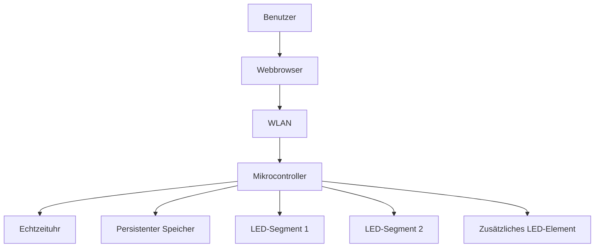
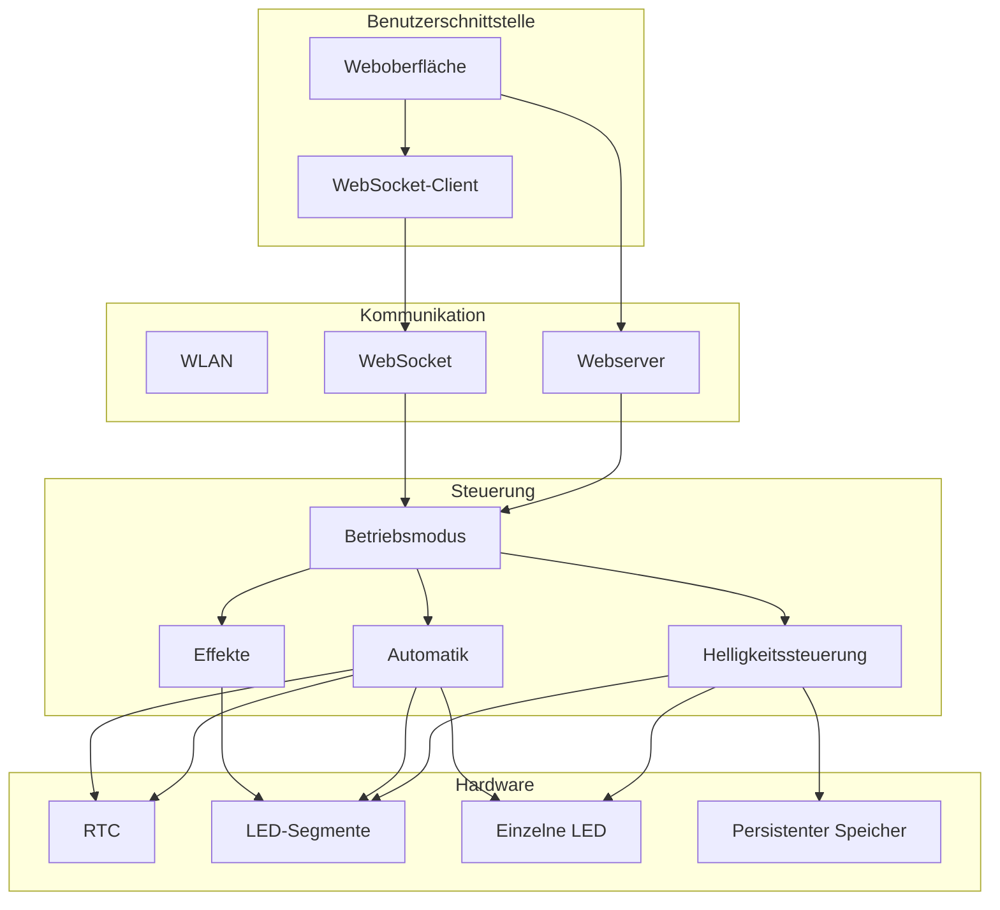
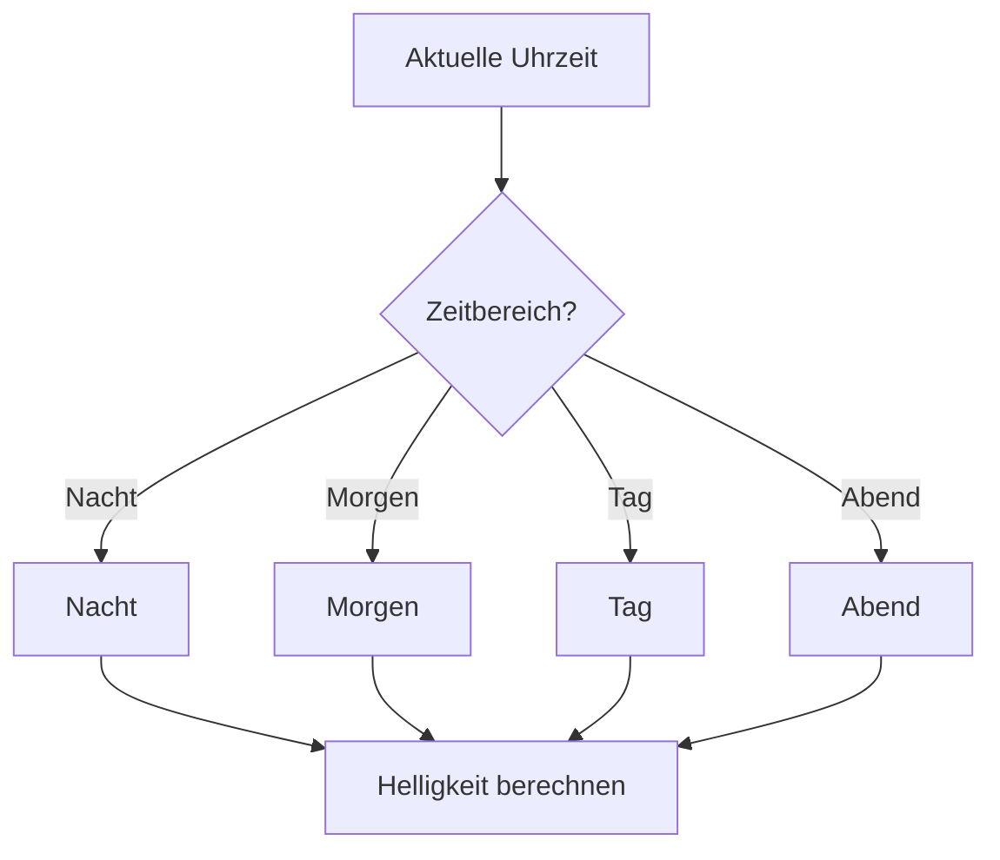
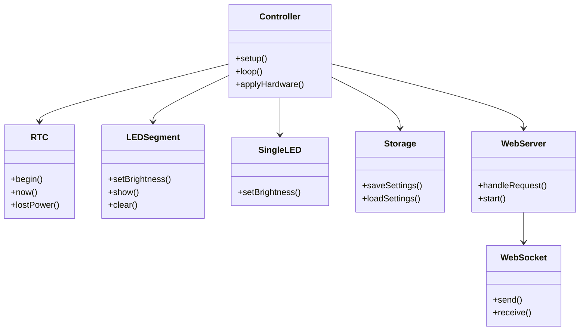
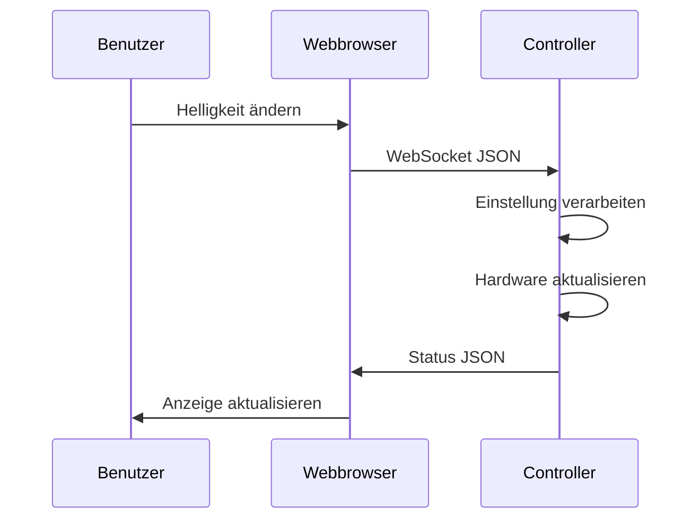
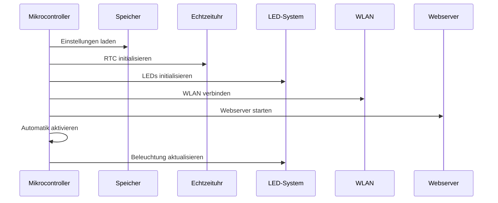
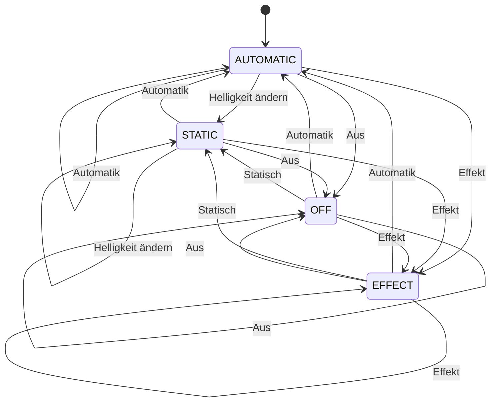
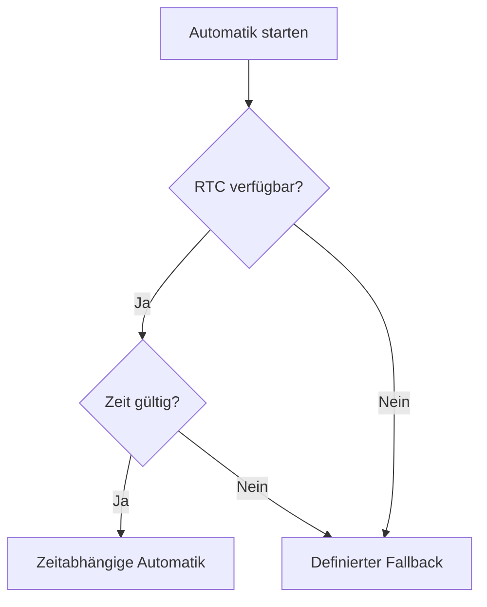
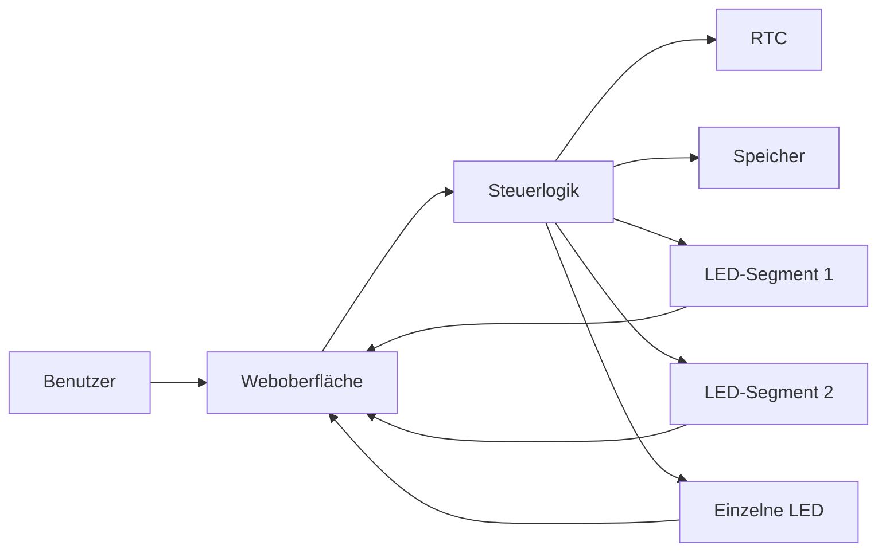

# LED-Beleuchtungssteuerung

## Technische Dokumentation

**Projekt:** Intelligente LED-Fassadenbeleuchtung  
**Plattform:** ESP32 (Arduino / PlatformIO)  
**Kommunikation:** WLAN (nur lokal), HTTP/REST + WebSocket  
**Bedienung:** Weboberfläche als installierbare App (PWA)  
**Zeitsteuerung:** Echtzeituhr (DS3231) mit NTP-Abgleich und NTP-Fallback  
**LED-Steuerung:** Adressierbare LEDs (WS2812/WS2811), ausschließlich Weiß  
**Betriebsmodi:** Grundmodi, Effekte (Lauflicht/Pulsieren/Atmen) und feste
feste Stimmungs-Modi (Dauerlicht, Kerzenlicht, Stufenlicht, Dämmerlicht, Feuerschein, Nachtlicht)  
**Netzwerk:** WLAN-Zugangsdaten fest im Code (`config.h`), Setup-Accesspoint als Fallback,
Zugriff auch über `http://led-fassade.local` (mDNS)  
**Sicherheit:** Software-Helligkeits- und Strombegrenzung, entprelltes Speichern  
**Konfiguration:** Persistenter Speicher (NVS) inkl. eigener Szenen;
WLAN-Zugangsdaten dagegen fest im Code (`config.h`)

**Firmware-Version:** 2.4.1

---

# 1. Projektbeschreibung

Dieses Projekt beschreibt eine mikrocontrollerbasierte Steuerung für eine
mehrteilige LED-Beleuchtungsanlage.

Das System ermöglicht die Steuerung verschiedener Beleuchtungsbereiche
über eine lokale Weboberfläche.

Die Beleuchtung kann sowohl manuell als auch automatisch betrieben werden.

Die wesentlichen Funktionen sind:

- Ein- und Ausschalten der Beleuchtung
- Manuelle Helligkeitsregelung
- Getrennte Steuerung mehrerer LED-Segmente
- Steuerung eines zusätzlichen LED-Elements (Logo)
- Automatische zeitabhängige Beleuchtung
- Verschiedene Beleuchtungseffekte (Lauflicht, Pulsieren, Atmen)
- Feste Stimmungs-Modi (Dauerlicht, Kerzenlicht, Stufenlicht, Dämmerlicht, Feuerschein, Nachtlicht)
- Echtzeituhr zur Zeitsteuerung mit NTP-Abgleich
- Speicherung von Einstellungen und eigenen Szenen
- WLAN-Kommunikation, Zugangsdaten fest im Code (Setup-AP als Fallback für lokalen Zugriff)
- Weboberfläche als installierbare App (PWA)
- WebSocket-Kommunikation
- Statusanzeige
- Firmware-Update über Netzwerk (OTA)

---

# 2. Systemübersicht

Das System besteht aus mehreren funktionalen Komponenten.



Der Mikrocontroller bildet die zentrale Steuereinheit.

Er empfängt Befehle über das Netzwerk, verarbeitet die Einstellungen und
steuert anschließend die angeschlossenen Beleuchtungselemente.

---

# 3. Systemarchitektur

Die Software ist logisch in mehrere Bereiche aufgeteilt.



---

# 4. Betriebsmodi

Die Beleuchtungssteuerung verfügt über mehrere Betriebsarten. Jeder Modus
hat eine feste Nummer, die über `mode` im JSON übertragen wird.

| Nr. | Modus         | Art          | Beschreibung (Kurz)                         |
| --- | ------------- | ------------ | ------------------------------------------- |
| 0   | Aus           | Grundmodus   | alles aus                                   |
| 1   | Statisch      | Grundmodus   | feste Helligkeit je Bereich (Regler)        |
| 2   | Lauflicht     | Effekt       | wandernder Lichtpunkt                        |
| 3   | Automatik     | Grundmodus   | tageszeitabhängige Helligkeit                |
| 4   | Pulsieren     | Effekt       | zügiges Auf-/Abschwellen                      |
| 5   | Atmen         | Effekt       | langsames, ruhiges Auf-/Abschwellen          |
| 6   | Dauerlicht    | Stimmung     | stetig, ganz langsam atmend                  |
| 7   | Kerzenlicht   | Stimmung     | zwei sanft flackernde Lichter                |
| 8   | Stufenlicht   | Stimmung     | Lichter bauen sich in acht Schritten auf     |
| 9   | Dämmerlicht   | Stimmung     | sehr gedämpftes, minutenlanges Schwellen     |
| 10  | Welle         | Effekt       | räumliche Sinuswelle wandert über den Streifen |
| 11  | Feuerschein   | Stimmung     | eine kräftige, ruhig flackernde Flamme        |
| 12  | Nachtlicht    | Stimmung     | ruhige, stetig brennende Kerze                |

Die **Effekte** (2, 4, 5, 10) verwenden eine gemeinsame Effekt-Helligkeit
(`global`, per Regler einstellbar). Die **Stimmungs-Modi** (6–9, 11, 12) sind
bewusst fest hinterlegt und nicht über die Regler verstellbar
(Ausstellungsbetrieb); sie schalten sich zwischen 23:00 und 06:00
automatisch ab.

## 4.1 Aus

In diesem Modus werden alle Beleuchtungselemente ausgeschaltet.

```text
MODE_OFF
```

Eigenschaften:

* LED-Segmente aus
* zusätzliche LED aus
* keine Effektberechnung
* keine automatische Helligkeit

---

## 4.2 Statisch

Im statischen Modus werden die Helligkeitswerte direkt verwendet.

```text
MODE_STATIC
```

Beispiel:

```text
Segment 1: 80 %
Segment 2: 60 %
LED:       40 %
```

Die einzelnen Werte können unabhängig voneinander eingestellt werden.

---

## 4.3 Effekte (Lauflicht, Pulsieren, Atmen)

In den Effektmodi wird eine dynamische Lichtanimation ausgeführt. Alle drei
Effekte verwenden dieselbe **Effekt-Helligkeit** (`global`), die getrennt von
den Segment-Reglern eingestellt wird.

```text
MODE_EFFECT   (2)  Lauflicht
MODE_PULSE    (4)  Pulsieren
MODE_BREATH   (5)  Atmen
```

**Lauflicht** – ein wandernder Lichtpunkt läuft über die Kette:

```text
LED 1
LED 2
LED 3
LED 4
LED 5
...

   ●
```

**Pulsieren** und **Atmen** lassen alle LEDs gemeinsam heller und dunkler
werden – Pulsieren zügig, Atmen langsam und ruhig. Beide nutzen eine weiche
Sinuswelle:

```text
Atmen:   dunkel → hell → dunkel → hell   (langsam)
Pulsieren: dunkel → hell → dunkel → hell (schneller)
```

Die Effekte werden jeden Frame (ca. 50-mal pro Sekunde) neu berechnet.

---

## 4.4 Automatik

Die Automatik verwendet die aktuelle Uhrzeit.

```text
MODE_AUTOMATIC
```

Abhängig von der Uhrzeit wird automatisch eine Helligkeit berechnet.

Beispiel:

```text
Nacht       → 0 %
Morgen      → 0 → 90 %
Tag         → 90 %
Abend       → 60 → 25 %
Nacht       → 0 %
```

---

## 4.5 Stimmungs-Modi

Zusätzlich zu den Grundmodi und Effekten gibt es sechs feste
Lichtstimmungen für den Ausstellungsbetrieb. Ihre Werte (Helligkeit, Tempo)
sind **fest im Code hinterlegt** und werden nicht über die Regler verändert.
Alle sechs schalten sich zwischen **23:00 und 06:00** automatisch ab.

**Dauerlicht (Nr. 6)** – ein stetiges, ganz langsam „atmendes"
Licht auf hohem Grundniveau. Es geht (außer nachts) nie ganz aus.

```text
Helligkeit: ~73 % … ~82 %   ein Atemzug ≈ 18 Sekunden
```

**Kerzenlicht (Nr. 7)** – zwei unabhängig voneinander sanft flackernde
Lichter (über eine Rauschfunktion erzeugt), je eines pro Segment.

```text
Segment Links  ≈ Flamme 1   (sanftes Flackern)
Segment Rechts ≈ Flamme 2   (sanftes Flackern)
```

**Stufenlicht (Nr. 8)** – die Lichter bauen sich in acht Schritten auf: erst
eines, dann immer mehr, bis alle acht leuchten; danach beginnt der Aufbau von
vorn. Ein langsamer, gleichmäßiger Effekt.

```text
Schritt 1: ▮▯▯▯▯▯▯▯
Schritt 2: ▮▮▯▯▯▯▯▯
...
Schritt 8: ▮▮▮▮▮▮▮▮   → kurz halten, dann von vorne
```

**Dämmerlicht (Nr. 9)** – sehr gedämpftes Licht, das über Minuten ganz sanft
auf- und abschwillt. Ruhige, stille Stimmung.

```text
Helligkeit: ~5 % … ~18 %   ein Durchlauf ≈ 2,5 Minuten
```

**Feuerschein (Nr. 11)** – eine kräftige, ruhig flackernde Flamme, heller als
das Kerzenlicht und über beide Segmente gemeinsam.

```text
Helligkeit: ~59 % … ~90 %   ruhiges Flackern (eine Flamme)
```

**Nachtlicht (Nr. 12)** – eine ruhige, stetig brennende Kerze, sehr niedrig mit
nur leisem Flackern.

```text
Helligkeit: ~12 % … ~21 %   stetig, kaum bewegt
```

---

## 4.6 Eigene Szenen (Presets)

Der Benutzer kann eigene Beleuchtungs-Szenen anlegen, benennen und
dauerhaft speichern. Eine Szene enthält ausschließlich die
Helligkeiten der drei Bereiche – die Lichtfarbe ist immer Weiß.

```text
Szene "Abend"   → Links 40 % · Rechts 40 % · Logo 60 %
Szene "Voll"    → Links 100 % · Rechts 100 % · Logo 100 %
```

Eigenschaften:

* bis zu 6 Szenen, im persistenten Speicher (NVS) abgelegt
* über die Weboberfläche speichern, abrufen und löschen
* das Abrufen einer Szene entspricht einem manuellen Eingriff
  (statischer Modus) und übersteuert damit die Automatik

Ablauf beim Speichern/Abrufen:

```text
Regler einstellen
       │
       ▼
Szene benennen + speichern  ──►  NVS
       │
       ▼
später: Szene antippen      ──►  Helligkeiten werden gesetzt
```

---

# 5. Zeitabhängige Steuerung

Die Automatik benötigt die aktuelle Uhrzeit. Diese wird aus der
besten verfügbaren Quelle bezogen (Funktion `getCurrentTime`):

```text
1. Echtzeituhr (DS3231), falls vorhanden und plausibel
2. NTP / Systemzeit, falls einmal synchronisiert
3. sonst: sicherer Standardwert (gedimmte Grundhelligkeit)
```

Dadurch funktioniert die Automatik auch **ohne** Echtzeituhr,
solange einmal per NTP synchronisiert wurde. Ist eine DS3231
verbaut, liefert sie die Zeit unmittelbar nach dem Einschalten –
auch ohne WLAN – und wird bei Internetverbindung per NTP
nachgeführt (inkl. Sommer-/Winterzeit).

Die aktuelle Uhrzeit wird regelmäßig ausgelesen.



---

# 6. Helligkeitsberechnung

Die Helligkeit wird als Prozentwert behandelt.

Der Wertebereich ist:

```text
0 %   = ausgeschaltet
100 % = maximale Helligkeit
```

Für adressierbare LEDs wird der Prozentwert auf einen 8-Bit-Wert
umgerechnet.

```text
0 %   → 0
50 %  → ca. 127
100 % → 255
```

Dadurch kann die Helligkeit mit den üblichen LED-Werten verarbeitet werden.

---

# 7. Weiche Übergänge

Sämtliche Helligkeitsänderungen erfolgen weich, ohne harte Sprünge.
Die Modus-Logik setzt nur eine **Ziel-Helligkeit** je Bereich; ein
separater Renderer (`renderSolid`) führt die angezeigte Helligkeit
in kleinen Schritten an dieses Ziel heran.

```text
Ziel gesetzt (z. B. 90 %)
       │
       ▼
angezeigt: 0 → 2 → 4 → ... → 90   (ca. 1 s)
```

Das gilt für Moduswechsel (z. B. Aus → Automatik) ebenso wie für
die tageszeitabhängige Kurve der Automatik. Die Automatik blendet
zusätzlich über längere Zeiträume ein und aus.

Beispiel:

```text
06:00 →   0 %
06:30 →  22 %
07:00 →  45 %
07:30 →  67 %
08:00 →  90 %
```

Die Berechnung erfolgt über einen Fortschrittswert zwischen `0.0` und `1.0`.

Vereinfacht:

```text
Fortschritt =
    (aktuelle Zeit - Startzeit)
    /
    (Endzeit - Startzeit)
```

Anschließend wird die Helligkeit interpoliert.

---

# 8. Hardwaremodell

Die Hardware kann grundsätzlich aus folgenden Komponenten bestehen:



---

# 9. LED-Segmente

Die Beleuchtung kann aus mehreren unabhängig steuerbaren Segmenten bestehen.

Beispiel:

```text
             Beleuchtungsanlage
                    │
          ┌─────────┴─────────┐
          │                   │
      Segment 1           Segment 2
          │                   │
       LEDs                LEDs
```

Jedes Segment kann einen eigenen Helligkeitswert besitzen.

Dadurch ist beispielsweise möglich:

```text
Segment 1 = 100 %
Segment 2 = 50 %
```

---

# 10. Einzelnes LED-Element

Zusätzlich zu den LED-Segmenten kann eine einzelne adressierbare LED
verwendet werden.

Diese LED kann beispielsweise ein Symbol, Logo oder Statussignal
darstellen.

Im Gegensatz zu einem separaten PWM-Ausgang wird diese LED direkt über
die adressierbare LED-Kette gesteuert.

Beispiel:

```text
LED-Segment 1
    │
    ├── LED
    ├── LED
    ├── LED
    └── ...

LED-Segment 2
    │
    ├── LED
    ├── LED
    ├── LED
    └── ...

Einzelne LED
    │
    └── Logo / Symbol
```

---

# 11. Weboberfläche (Bedien-App / PWA)

Die Weboberfläche ermöglicht die Bedienung des Systems über einen
normalen Webbrowser. Sie ist als **Progressive Web App (PWA)**
ausgeführt: über „Zum Startbildschirm hinzufügen" kann sie wie eine
App installiert werden und startet dann im Vollbild mit eigenem Icon.

Der Controller liefert dazu selbst aus:

```text
/               Bedienoberfläche (HTML)
/manifest.json  App-Manifest (Name, Icon, Vollbild)
/icon.svg       App-Icon
/api/status     Status als JSON (REST)
/api/schedule   Automatik-Zeitprofil lesen (REST)
/update         Firmware-Update (OTA, POST)
/ws             WebSocket (Live-Bedienung, auch Zeitprofil schreiben)
```

Funktionen:

* Betriebsmodus auswählen (alle 10 Modi als Kacheln)
* Helligkeit je Bereich einstellen (Links, Rechts, Logo)
* Effekt-Helligkeit einstellen (für Lauflicht/Pulsieren/Atmen)
* eigene Szenen speichern, abrufen und löschen
* Automatik-Zeitprofil (Zeiten und Helligkeiten) einstellen
* Tagesverlauf der Automatik als 24-Stunden-Kurve mit „jetzt"-Markierung
  vorschauen (aktualisiert sich live beim Bearbeiten der Werte)
* aktuellen Modus samt Kurzbeschreibung anzeigen
* Uhrzeit, RTC-/NTP-Status, WLAN-Status und IP anzeigen

Die Oberfläche ist in einem ruhigen, dunklen Design gehalten. Kopfzeile mit
Verbindungspunkt, Uhr und aktuellem Modus; darunter Karten für Modus-Auswahl,
Helligkeiten, Szenen, Automatik-Übersicht sowie WLAN & System.

Beispielhafte Oberfläche:

```text
+------------------------------------------+
| ● LED-Fassade     14:32   [ Stufenlicht ]|
+------------------------------------------+

 MODUS
 [ Aus         ] [ Statisch    ]
 [ Lauflicht   ] [ Automatik   ]
 [ Pulsieren   ] [ Atmen       ]
 [ Welle       ] [ Dauerlicht  ]
 [ Kerzenlicht ] [ Stufenlicht ]
 [ Dämmerlicht ] [ Feuerschein ]
 [ Nachtlicht  ]
 Lichter bauen sich in acht Schritten auf …

 SEGMENT LINKS      [=========-------] 70 %
 SEGMENT RECHTS     [======----------] 45 %
 LOGO               [========--------] 55 %
 EFFEKT-HELLIGKEIT  [===========-----] 75 %

 EIGENE SZENEN
 [ Abend · 40 / 40 / 30 ] [Entf.]

 WLAN & SYSTEM
  Firmware 2.4.1 · RTC OK · NTP synchron.
 WLAN verbunden · IP 192.168.x.x
```

---

# 12. WebSocket-Kommunikation

Für die Kommunikation zwischen Weboberfläche und Mikrocontroller wird
eine WebSocket-Verbindung verwendet.

Dadurch können Änderungen nahezu unmittelbar übertragen werden.



---

# 13. JSON-Kommunikation

Die Kommunikation kann beispielsweise folgende Struktur verwenden:

```json
{
    "mode": 1,
    "left": 80,
    "right": 60,
    "logo": 40
}
```

Von der App zum Controller können folgende Felder gesendet werden. Es müssen
nicht alle gleichzeitig vorhanden sein – der Controller wertet nur die aus,
die enthalten sind.

| Parameter      | Typ    | Bedeutung                                   |
| -------------- | ------ | ------------------------------------------- |
| `mode`         | 0–9    | Betriebsmodus (siehe Tabelle in Kap. 4)     |
| `left`         | 0–100  | Helligkeit Segment 1 (%)                    |
| `right`        | 0–100  | Helligkeit Segment 2 (%)                    |
| `logo`         | 0–100  | Helligkeit der einzelnen LED / Logo (%)     |
| `global`       | 0–100  | Effekt-Helligkeit für Lauflicht/Pulsieren/Atmen (%) |
| `savePreset`   | Text   | aktuelle Helligkeiten als Szene speichern   |
| `applyPreset`  | Slot   | gespeicherte Szene abrufen                  |
| `deletePreset` | Slot   | gespeicherte Szene löschen                  |
| `tMorning`     | 0–23   | Automatik: Beginn Hochfahren (Stunde)       |
| `tDay`         | 0–23   | Automatik: Beginn Tag (Stunde)              |
| `tEvening`     | 0–23   | Automatik: Beginn Abend (Stunde)            |
| `tNight`       | 0–23   | Automatik: Nachtabschaltung (Stunde)        |
| `bMorning`     | 0–100  | Automatik: Zielhelligkeit beim Hochfahren (%) |
| `bDay`         | 0–100  | Automatik: Tageshelligkeit (%)              |
| `bEveStart`    | 0–100  | Automatik: Abend-Starthelligkeit (%)        |
| `bEveEnd`      | 0–100  | Automatik: Abend-Endhelligkeit (%)          |

Eine Änderung von `left`, `right` oder `logo` während der Automatik wechselt
automatisch in den statischen Modus (manueller Eingriff, siehe Kap. 21). Die
`t…`/`b…`-Felder ändern dagegen nur das gespeicherte Zeitprofil und lassen
den aktiven Modus unberührt – so lässt sich die Automatik-Kurve (Zeiten und
Helligkeiten) direkt aus der App parametrieren.

Die App prüft das Zeitprofil vor dem Senden: Die Uhrzeiten müssen aufsteigend
sein (`tMorning < tDay < tEvening < tNight`), damit die Automatik-Kurve
lückenlos bleibt. Andernfalls weist die App darauf hin und sendet nicht.

---

# 14. Statusinformationen

Der Controller sendet nach jeder Änderung und regelmäßig (alle 2 Sekunden)
seinen vollständigen Status an alle verbundenen Clients.

Beispiel:

```json
{
    "mode": 3,
    "left": 80,
    "right": 80,
    "logo": 80,
    "global": 75,
    "autoBrightness": 88,
    "rtc": true,
    "ntp": false,
    "time": "18:42:10",
    "date": "20.08.2026",
    "ip": "192.168.1.100",
    "rssi": -58,
    "wifi": true,
    "ap": false,
    "ssid": "Museum-Arbeitswelt",
    "firmware": "2.4.1",
    "presets": [
        { "slot": 0, "name": "Abend", "left": 40, "right": 40, "logo": 30 }
    ]
}
```

Bedeutung der wichtigsten Felder:

| Feld             | Bedeutung                                           |
| ---------------- | --------------------------------------------------- |
| `autoBrightness` | aktuell berechnete Automatik-Helligkeit (%)         |
| `rtc` / `ntp`    | Zeitquelle verfügbar / synchronisiert               |
| `wifi` / `ap`    | im WLAN verbunden / Setup-Accesspoint aktiv         |
| `ssid`           | Name des aktuell genutzten WLANs                    |
| `presets`        | Liste der gespeicherten Szenen                      |

Damit kann die Weboberfläche den aktuellen Systemzustand anzeigen.

---

# 15. REST-Schnittstelle

Zusätzlich zur WebSocket-Kommunikation kann eine REST-Schnittstelle
bereitgestellt werden.

Beispiel:

```text
GET /api/status
```

Die Schnittstelle liefert Informationen über:

* Betriebsmodus
* Helligkeit
* Uhrzeit
* RTC-Zustand
* Netzwerkstatus

---

# 16. Persistente Einstellungen

Bestimmte Einstellungen werden dauerhaft gespeichert.

Dazu kann der nichtflüchtige Speicher des Mikrocontrollers verwendet
werden.

Gespeichert werden beispielsweise:

```text
Segment 1 Helligkeit
Segment 2 Helligkeit
Einzelne LED Helligkeit
Effekt-Helligkeit (global)

Morgen-Helligkeit
Tag-Helligkeit
Abend-Helligkeit

Startzeit Nacht
Endzeit Nacht

Eigene Szenen (Name + Helligkeiten)
```

Die WLAN-Zugangsdaten stehen dagegen **fest im Code** (`config.h`) und werden
nicht im NVS gespeichert. Nach einem Neustart können alle übrigen Werte
wieder geladen werden.

**Entprelltes Speichern:** Beim Ziehen eines Reglers ändern sich die
Werte sehr schnell hintereinander. Würde bei jeder Änderung sofort in
den Flash geschrieben, würde dieser unnötig abgenutzt. Deshalb wird eine
Änderung zunächst nur vorgemerkt; tatsächlich geschrieben wird erst,
wenn eine kurze Zeit (ca. 1,5 s) lang keine weitere Änderung mehr kam.

---

# 17. Verhalten nach Neustart

Ein wichtiger Bestandteil der Software ist ein definierter
Power-On-Zustand.

Nach einem Neustart wird nicht automatisch der zuletzt verwendete
Betriebsmodus übernommen.

Stattdessen wird ein definierter Betriebsmodus verwendet:

```text
Controller startet
       │
       ▼
Einstellungen laden
       │
       ▼
RTC initialisieren
       │
       ▼
LED-Hardware initialisieren
       │
       ▼
Netzwerk initialisieren
       │
       ▼
Automatik aktivieren
       │
       ▼
Beleuchtung aktualisieren
```

Dadurch wird verhindert, dass beispielsweise nach einem Stromausfall
unbeabsichtigt ein manueller Effekt weiterläuft.

---

# 18. Startsequenz

Die Initialisierung erfolgt grundsätzlich in mehreren Schritten.



---

# 19. Hauptprogramm

Das Programm besteht grundsätzlich aus zwei zentralen Funktionen:

```cpp
setup()
loop()
```

## setup()

`setup()` wird einmal beim Start ausgeführt.

Typische Aufgaben:

```text
Initialisierung
↓
Einstellungen laden
↓
RTC starten
↓
LEDs starten
↓
WLAN verbinden
↓
Webserver starten
↓
Automatik aktivieren
```

---

## loop()

`loop()` wird kontinuierlich wiederholt.

Beispiel:

```text
loop()
 │
 ├── WebSocket Clients prüfen
 │
 ├── Automatik aktualisieren
 │
 ├── Effekt aktualisieren
 │
 ├── Status senden
 │
 └── kurze Pause
 │
 └──────► loop()
```

---

# 20. Zustandsdiagramm

Das Verhalten der Betriebsmodi lässt sich als Zustandsautomat darstellen.



Zur besseren Übersicht sind hier nur die Grundzustände dargestellt.
`EFFECT` steht dabei stellvertretend für **alle** dynamischen Modi: die
Effekte (Lauflicht, Pulsieren, Atmen, Welle) und die Stimmungs-Modi
(Dauerlicht, Kerzenlicht, Stufenlicht, Dämmerlicht, Feuerschein, Nachtlicht).
Sie verhalten sich beim Wechsel
gleich – aus jedem dieser Modi kann direkt in jeden anderen gewechselt
werden, und jeder gilt (außer Automatik) als manueller Eingriff.

---

# 21. Manuelle Bedienung

Eine manuelle Änderung der Helligkeit kann automatisch den
Automatikmodus verlassen.

Beispiel:

```text
Automatik
    │
    │ Benutzer ändert Helligkeit
    ▼
Statisch
```

Damit erhält der Benutzer sofort die Kontrolle über die Beleuchtung.

Die Rückkehr zur Zeitsteuerung erfolgt **selbsttätig**: Beim nächsten
Wechsel des Automatik-Zeitfensters (z. B. Tag → Abend) schaltet das
System automatisch zurück in den Automatikmodus. Zusätzlich kann die
Automatik jederzeit manuell wieder aktiviert werden.

```text
Automatik
    │ manueller Eingriff
    ▼
Statisch / Szene
    │ nächster Zeitfenster-Wechsel
    ▼
Automatik
```

---

# 22. Sicherheitskonzept

Die Software sollte grundsätzlich folgende Eigenschaften besitzen:

* gültige Wertebereiche prüfen
* Helligkeitswerte begrenzen (0–100 %)
* Gesamtstrom begrenzen (Schutz vor Netzteilüberlastung)
* ungültige Betriebsmodi ignorieren
* Kommunikationsfehler behandeln
* fehlende RTC erkennen
* WLAN-Ausfall tolerieren
* ungültige JSON-Daten ablehnen
* Hardware in einen definierten Zustand bringen

Zur Strombegrenzung wird der maximale Gesamtstrom der LED-Kette
softwareseitig gedeckelt (Spannung und maximaler Strom in mA). Die
Bibliothek skaliert die Helligkeit bei Bedarf automatisch herunter,
sodass Netzteil und Verkabelung nicht überlastet werden.

---

# 23. Verhalten bei WLAN-Ausfall

Die Beleuchtung sollte nicht vom WLAN abhängig sein.

Wenn keine WLAN-Verbindung vorhanden ist:

```text
WLAN nicht verfügbar
       │
       ▼
Controller läuft weiter
       │
       ├── RTC funktioniert
       │
       ├── Automatik funktioniert
       │
       └── LED-Steuerung funktioniert
```

Das Netzwerk dient somit hauptsächlich zur Bedienung und Überwachung.

**Setup-Accesspoint:** Kann sich der Controller nicht mit dem
im Code hinterlegten WLAN verbinden, spannt er selbst ein eigenes WLAN
(Accesspoint) auf. Darüber bleibt die Bedienoberfläche zur lokalen
Steuerung erreichbar, auch wenn das eigentliche WLAN gerade nicht
verfügbar ist. Die WLAN-Zugangsdaten selbst ändert man im Code
(`config.h`) und spielt die Firmware neu auf.

```text
WLAN-Verbindung fehlgeschlagen
       │
       ▼
Setup-Accesspoint "Fassade-Setup" wird geöffnet
       │
       ▼
Handy/Notebook verbinden → Oberfläche öffnen (lokale Steuerung)
```

Im normalen WLAN ist der Controller zusätzlich unter dem Namen
`http://led-fassade.local` erreichbar (mDNS), sodass die IP-Adresse
nicht bekannt sein muss.

## 23.1 WLAN einstellen (`config.h`)

Die WLAN-Zugangsdaten sind **fest im Code hinterlegt** und werden **nicht**
im NVS gespeichert und **nicht** über die App geändert (Pflichtenheft: rein
lokale Bedienung, feste Zugangsdaten). Geändert werden sie in
`include/config.h`:

```c
#define WIFI_SSID     "Museum-Arbeitswelt"   // WLAN-Name
#define WIFI_PASS     "willkommen"           // WLAN-Passwort
#define SETUP_AP_SSID "Fassade-Setup"        // Notfall-Accesspoint (nur Zugriff)
#define SETUP_AP_PASS "fassade2026"
```

Nach einer Änderung muss die Firmware neu aufgespielt werden:

```text
pio run -t upload
```

Der Setup-Accesspoint (`SETUP_AP_*`) dient nur dazu, den Controller bei
WLAN-Ausfall lokal zu erreichen; er bietet **keine** Eingabe neuer
Zugangsdaten. Ein WLAN-Wechsel im Betrieb (Setup-Portal mit Speicherung im
NVS) ist bewusst nicht umgesetzt und wäre eine mögliche Erweiterung.

---

# 24. Verhalten bei RTC-Ausfall

Auch ein Ausfall der Echtzeituhr sollte erkannt werden.



Der Fallback sollte so gewählt werden, dass kein unerwarteter
Betriebszustand entsteht.

---

# 25. OTA-Update

Das System kann grundsätzlich eine Firmware-Aktualisierung über das
Netzwerk unterstützen.

OTA bedeutet:

```text
Over The Air
```

Dabei wird eine neue Firmware über die Netzwerkverbindung übertragen.

Vereinfachter Ablauf:

```text
Computer
   │
   │ Firmware
   ▼
Controller
   │
   ├── Firmware prüfen
   │
   ├── Flash schreiben
   │
   └── Neustart
```

---

# 26. Datenfluss

Der gesamte Datenfluss kann vereinfacht so dargestellt werden:



---

# 27. Softwarekomponenten

| Komponente            | Aufgabe                          |
| --------------------- | -------------------------------- |
| WLAN-Modul            | Netzwerkverbindung               |
| Webserver             | Bereitstellung der Weboberfläche |
| WebSocket             | Echtzeitkommunikation            |
| JSON                  | Datenformat                      |
| RTC                   | Zeitmessung                      |
| LED-Treiber           | Ansteuerung der LEDs             |
| Persistenter Speicher | Speicherung von Einstellungen    |
| OTA-Modul             | Firmware-Aktualisierung          |

---

# 28. Erweiterungsmöglichkeiten

Das System kann später erweitert werden.

Bereits umgesetzt (siehe oben):

* eigene Beleuchtungsszenen (Presets)
* mehrere Effekte (Lauflicht, Pulsieren, Atmen)
* feste Stimmungs-Modi (Dauerlicht, Kerzenlicht, Stufenlicht, Dämmerlicht, Feuerschein, Nachtlicht)
* Zeitserver (NTP) inkl. automatischer Sommer-/Winterzeit
* installierbare Bedien-App (PWA)
* WLAN-Zugangsdaten fest im Code (`config.h`), Setup-Accesspoint als Fallback für lokalen Zugriff
* Erreichbarkeit über Namen (`led-fassade.local`, mDNS)
* Software-Strombegrenzung, entprelltes Speichern

Mögliche weitere Erweiterungen:

* Sonnenaufgangs- und Sonnenuntergangsberechnung
* Kalendersteuerung
* Feiertagsbetrieb (automatisches Umschalten der thematischen Modi)
* Umgebungslichtsensor
* Energieüberwachung
* Benutzerverwaltung / Passwortschutz
* MQTT / Home-Automation-Anbindung

---

# 29. Softwarestruktur

Konfiguration, Steuerlogik und Bedienoberfläche sind voneinander getrennt:

```text
include/
│
├── config.h      Zentrale Konfiguration: WLAN, Pins, LED-Anzahl,
│                 Grenzwerte, Betriebsmodi, Werte der
│                 thematischen Modi
│
└── icons.h       PNG-Home-Screen-Icons als Byte-Arrays (generiert)

src/
│
├── main.cpp             C++-Logik (Modi, Automatik, Szenen,
│                        WLAN, Webserver, WebSocket, OTA)
│
├── web_page.h           Bedien-App: HTML, CSS, JavaScript,
│                        App-Manifest und Icons (PWA)
│
└── web_page_demo.html   zweite Variante: läuft ohne ESP32/Server
                         (aus web_page.h generiert)

tools/
│
├── mock-server.js   Test-Server (Node.js), simuliert die
│                    ESP32-API zum Bedienen der Seite am PC
│
├── build-demo.js    erzeugt web_page_demo.html aus web_page.h
│
├── build-icons.js   erzeugt icons.h aus tools/icons/*.png
│
└── icons/           Home-Screen-Icons (icon-180/192/512.png)
```

Dadurch lässt sich die Anlage an neue Hardware anpassen (`config.h`) und
das Aussehen der Oberfläche (`web_page.h`) unabhängig von der
Steuerlogik (`main.cpp`) bearbeiten.

**Testen ohne ESP32:** Der Mock-Server bildet die komplette API nach
(WebSocket + `/api/status` + `/api/schedule`) und liefert die Seite direkt
aus `web_page.h` aus. So ist die Bedienoberfläche mit allen Funktionen
(Modi, Regler, Szenen, Zeitprofil) am PC bedienbar:

```text
node tools/mock-server.js      →  http://localhost:5598
```

Für ein weiteres Wachstum empfiehlt sich eine feinere Aufteilung:

Beispiel:

```text
src/
│
├── main.cpp
│
├── config.h
│
├── leds.cpp
├── leds.h
│
├── automation.cpp
├── automation.h
│
├── rtc.cpp
├── rtc.h
│
├── network.cpp
├── network.h
│
├── webserver.cpp
├── webserver.h
│
├── storage.cpp
└── storage.h
```

Dadurch können die einzelnen Funktionen unabhängig voneinander
bearbeitet und getestet werden.

---

# 30. Zusammenfassung

Die LED-Beleuchtungssteuerung ist als eigenständiges,
netzwerkfähiges Steuerungssystem aufgebaut.

Die zentrale Steuerung übernimmt:

```text
                ┌─────────────────┐
                │  Mikrocontroller│
                └────────┬────────┘
                         │
        ┌────────────────┼────────────────┐
        │                │                │
        ▼                ▼                ▼
      WLAN              RTC            Speicher
        │
        ▼
   Weboberfläche
        │
        ▼
   Steuerbefehle
        │
        ▼
  Betriebslogik
        │
    ┌───┼────┐
    │   │    │
    ▼   ▼    ▼
  LED1 LED2 LED
```

Durch die Kombination aus Weboberfläche, Echtzeituhr,
automatischer Helligkeitssteuerung und lokaler Hardwaresteuerung
entsteht ein flexibles und erweiterbares Beleuchtungssystem.

Die Architektur ist so ausgelegt, dass die Beleuchtung auch bei
einem Ausfall der Netzwerkverbindung grundsätzlich weiter betrieben
werden kann.

---

### UML-Übersicht

In der Dokumentation sind bereits mehrere UML-/UML-nahe Diagramme enthalten:

- **Komponentendiagramm** – Systemarchitektur
- **Klassendiagramm** – Software-/Hardware-Komponenten
- **Sequenzdiagramm** – Startvorgang und WebSocket-Kommunikation
- **Zustandsdiagramm** – Betriebsmodi
- **Aktivitäts-/Ablaufdiagramme** – Automatik und Fehlerbehandlung

Die Diagramme sind in **Mermaid** geschrieben. Das ist praktisch, weil du die Markdown-Datei direkt in Editoren wie GitHub/GitLab oder mit Mermaid-fähigen Markdown-Tools verwenden kannst.

---

# Anhang A – Pflichtenheft-Abgleich

Gegenüberstellung der Anforderungen aus dem Pflichtenheft (MAW – LED-Fassaden­beleuchtung)
und ihrer Umsetzung in dieser Firmware (Version 2.4.1).

## A.1 Funktionale Anforderungen

| ID | Anforderung (Pflichtenheft Kap. 6) | Status | Umsetzung |
| -- | ---------------------------------- | ------ | --------- |
| F1 | Drei Leuchtbereiche (Links, Rechts, Logo) getrennt und gemeinsam ansteuerbar | erfüllt | Getrennte Helligkeiten `brightnessLeft/Right/Logo`; Regler in der App |
| F2 | Mehrere Betriebsmodi per App auswählbar | erfüllt | 13 Modi (Aus, Statisch, Automatik, 4 Effekte, 6 thematische Modi) |
| F3 | Automatik tageszeitabhängig inkl. Nachtabschaltung ab 23:00 | erfüllt | `calculateAutomaticBrightness`, feste Nachtgrenze über `isNightOff` |
| F4 | Helligkeit je Bereich manuell einstellbar | erfüllt | WebSocket-Befehle `left`/`right`/`logo` |
| F5 | Konfiguration persistent gespeichert | erfüllt | NVS-Flash (`Preferences`): Helligkeiten, Zeitprofil, Szenen (WLAN dagegen fest in `config.h`) |
| F6 | Nach Stromausfall definierter Zustand selbsttätig | erfüllt | `setup()` startet immer im Automatik-Modus, Zustand nach Uhrzeit |
| F7 | Netzunabhängige Zeitbasis (RTC), NTP-Abgleich wenn online | erfüllt | DS3231 sofort nach Boot; periodischer NTP-Abgleich inkl. Sommer-/Winterzeit |
| F8 | OTA-Firmware-Update über das lokale Netz | erfüllt | `POST /update` (Browser-Upload), danach Neustart |
| F9 | Bedienung ausschließlich im lokalen WLAN, kein Fernzugriff | erfüllt | Reiner STA-/AP-Betrieb, kein Cloud-Dienst, keine Portfreigabe |

## A.2 Abnahmekriterien

| Nr. | Kriterium (Pflichtenheft Kap. 12) | Status | Nachweis |
| --- | --------------------------------- | ------ | -------- |
| A1 | Links, Rechts, Logo einzeln und gemeinsam ansteuerbar | erfüllt | Getrennte Zielwerte, gemeinsames Rendern in `applyHardware`/`renderSolid` |
| A2 | Automatik-Kurve korrekt; Abschaltung 23:00 zuverlässig | erfüllt | Morgen-Rampe, Tag, Abend-Rampe, Nacht = 0; Kurven-Vorschau in der App |
| A3 | Manuelle Helligkeitsänderung ohne spürbare Verzögerung | erfüllt | WebSocket → sofort `applyHardware` (< 500 ms, NFR Kap. 5) |
| A4 | Nach Stromausfall Zustand nach Uhrzeit selbsttätig | erfüllt | Definierter Power-On-State + RTC-Zeit unmittelbar nach Boot |
| A5 | Konfiguration bleibt nach Stromausfall erhalten | erfüllt | NVS (`loadSettings`/`loadPresets`) |
| A6 | Helligkeits-/Strombegrenzung greift | erfüllt | `FastLED.setMaxPowerInVoltsAndMilliamps` + Software-Deckel `GLOBAL_MAX_BRIGHTNESS` |
| A7 | Bedienung ausschließlich lokal | erfüllt | siehe F9 |
| A8 | OTA-Update durchführbar | erfüllt | siehe F8 |

## A.3 Betriebsmodi & Override (Kap. 7)

- **Automatik** als Standardmodus mit weichen Übergängen (Fade) – entspricht Kap. 7.1.
- **Statisch** und **Effekte** (Lauflicht, Pulsieren/„Welle", Atmen) – entspricht Kap. 7.2.
- **Aus**: Bereiche aus, Controller bleibt im WLAN erreichbar – entspricht Kap. 7.3.
- **Override-Rückkehr**: umgesetzt als **Variante (a)** – Rückkehr in die Automatik beim
  nächsten Zeitfenster-Wechsel. Das ist die im Pflichtenheft (Kap. 7.4) empfohlene Variante.

## A.4 Offene Punkte (Hardware, Pflichtenheft Kap. 13)

Diese Werte sind im Pflichtenheft selbst als „noch zu klären" markiert und daher in
`include/config.h` als anpassbare Parameter hinterlegt:

| Punkt | Aktueller Wert (`config.h`) | Zu klären |
| ----- | --------------------------- | --------- |
| LED-Anzahl je Segment | `NUM_LEDS_LINKS 60`, `NUM_LEDS_RECHTS 60` | Bei Bedarf an reale Segmentlängen anpassen (Kap. 13) |
| LED-Typ | `WS2812` | Pflichtenheft schlägt WS2811 / 12 V vor (Kap. 4.1) |
| Strombegrenzung | `LED_VOLTS 5`, `LED_MAX_MILLIAMPS 2000` | Bei 120 LEDs (60+60) ist 2000 mA zu niedrig – FastLED dimmt sonst herunter; nach Netzteil-/Einspeisekonzept erhöhen (Kap. 4.2) |
| Sonnenstand-Kopplung | nicht umgesetzt | Optional (Kap. 7.1 `[OPTION]`) |

## A.5 Zusätzlich umgesetzt (über das Pflichtenheft hinaus)

Eigene Szenen (Presets), sechs feste Stimmungs-Modi (Dauerlicht, Kerzenlicht,
Stufenlicht, Dämmerlicht, Feuerschein, Nachtlicht), Setup-Accesspoint für den
lokalen Zugriff bei WLAN-Ausfall, Erreichbarkeit über `led-fassade.local`
(mDNS) sowie eine 24-Stunden-Kurven-Vorschau des Automatik-Profils.

**Ergebnis:** Alle funktionalen Anforderungen (F1–F9) und Abnahmekriterien (A1–A8) sind
umgesetzt. Offen sind ausschließlich die im Pflichtenheft als „zu klären" gekennzeichneten
Hardware-Parameter (Kap. 13).

