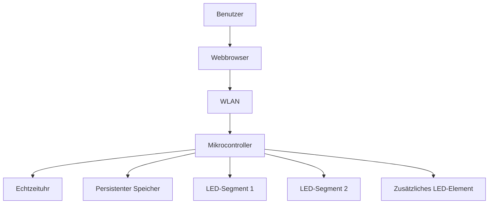
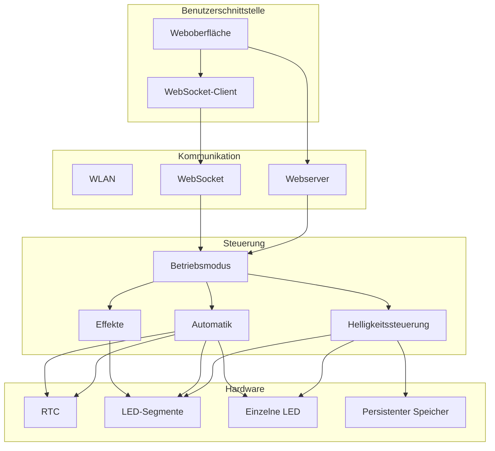
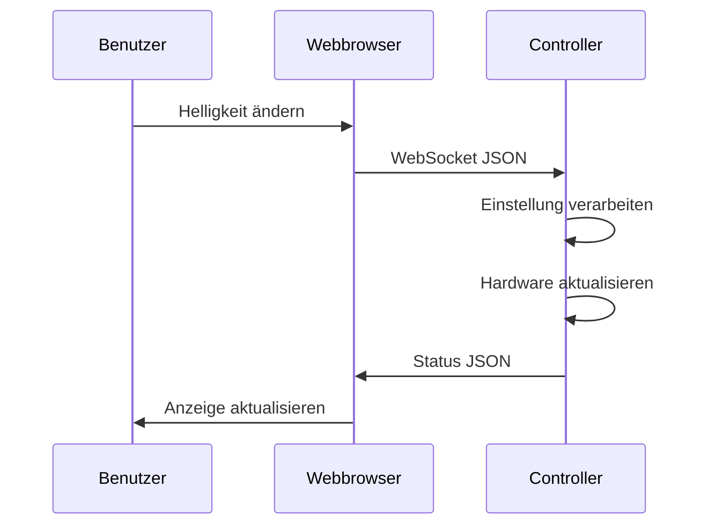
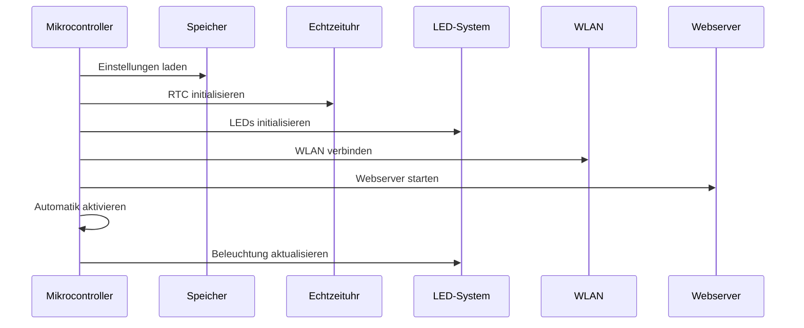
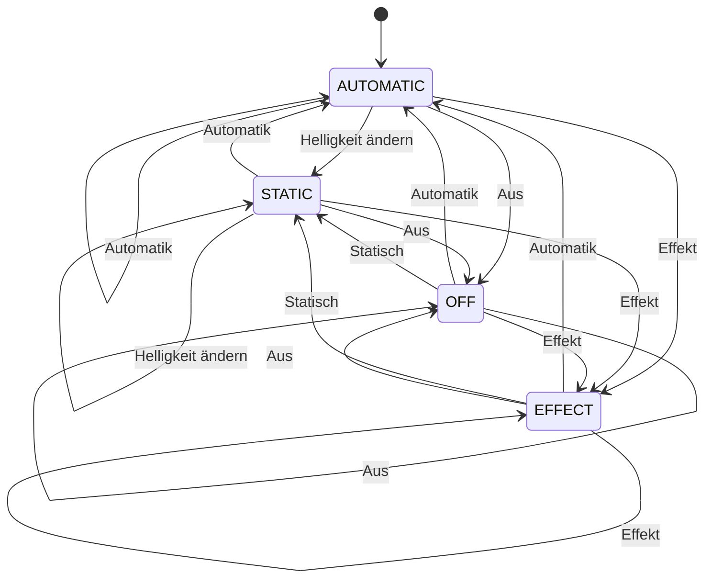
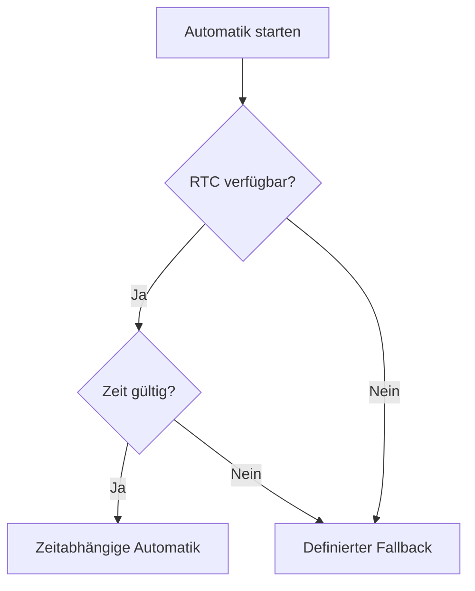
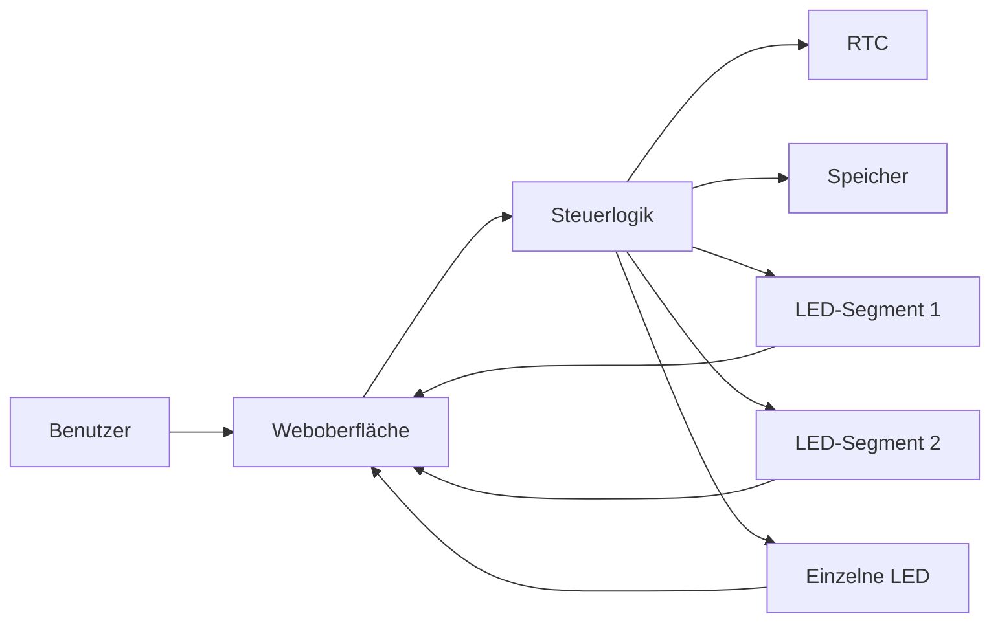

# LED-Beleuchtungssteuerung

## Technische Dokumentation

**Projekt:** Intelligente LED-Fassadenbeleuchtung  
**Plattform:** ESP32 (Arduino / PlatformIO)  
**Kommunikation:** WLAN (nur lokal), HTTP/REST + WebSocket  
**Bedienung:** Weboberfläche als installierbare App (PWA)  
**Zeitsteuerung:** Echtzeituhr (DS3231) mit NTP-Abgleich und NTP-Fallback  
**LED-Steuerung:** Adressierbare LEDs (WS2812/WS2811), ausschließlich Weiß  
**Betriebsmodi:** Grundmodi, Effekte (Lauflicht/Pulsieren/Atmen/Welle u. a.) und
feste Stimmungs-Modi (Dauerlicht, Kerzenlicht, Stufenlicht, Dämmerlicht, Feuerschein, Nachtlicht)  
**Netzwerk:** WLAN-Zugangsdaten fest im Code (`config.h`), Setup-Accesspoint als Fallback,
Zugriff auch über `http://led-fassade.local` (mDNS)  
**Sicherheit:** Software-Helligkeits- und Strombegrenzung, entprelltes Speichern  
**Konfiguration:** Persistenter Speicher (NVS) für die manuellen Helligkeiten;
WLAN-Zugangsdaten und Automatik-Profil fest im Code (`config.h`)

**Firmware-Version:** 2.4.3

---

# 1. Projektbeschreibung

Dieses Projekt beschreibt eine mikrocontrollerbasierte Steuerung für eine
mehrteilige LED-Beleuchtungsanlage.

Das System ermöglicht die Steuerung verschiedener Beleuchtungsbereiche
über eine lokale Weboberfläche.

Die Beleuchtung kann sowohl manuell als auch automatisch betrieben werden.

Die wesentlichen Funktionen sind:

- Ein- und Ausschalten der Beleuchtung
- Manuelle Helligkeitsregelung
- Getrennte Steuerung mehrerer LED-Segmente
- Steuerung eines zusätzlichen LED-Elements (Logo)
- Automatische zeitabhängige Beleuchtung
- Verschiedene Beleuchtungseffekte (Lauflicht, Pulsieren, Atmen)
- Feste Stimmungs-Modi (Dauerlicht, Kerzenlicht, Stufenlicht, Dämmerlicht, Feuerschein, Nachtlicht)
- Echtzeituhr zur Zeitsteuerung mit NTP-Abgleich
- Speicherung der Einstellungen (NVS)
- WLAN-Kommunikation, Zugangsdaten fest im Code (Setup-AP als Fallback für lokalen Zugriff)
- Weboberfläche als installierbare App (PWA)
- WebSocket-Kommunikation
- Statusanzeige
- Firmware-Update über Netzwerk (OTA)

---

# 2. Systemübersicht

Das System besteht aus mehreren funktionalen Komponenten.



Der Mikrocontroller bildet die zentrale Steuereinheit.

Er empfängt Befehle über das Netzwerk, verarbeitet die Einstellungen und
steuert anschließend die angeschlossenen Beleuchtungselemente.

---

# 3. Systemarchitektur

Die Software ist logisch in mehrere Bereiche aufgeteilt.



---

# 4. Betriebsmodi

Die Beleuchtungssteuerung verfügt über mehrere Betriebsarten. Jeder Modus
hat eine feste Nummer, die über `mode` im JSON übertragen wird.

> Eine kompakte, eigenständige Erklärung **aller** Modi (inkl. Parameter und
> Fassaden-Abstimmung) steht in [`modi.md`](modi.md).

| Nr. | Modus         | Art          | Beschreibung (Kurz)                         |
| --- | ------------- | ------------ | ------------------------------------------- |
| 0   | Aus           | Grundmodus   | alles aus                                   |
| 1   | Statisch      | Grundmodus   | feste Helligkeit je Bereich (Regler)        |
| 2   | Lauflicht     | Effekt       | weicher, langsam gleitender Lichtschweif      |
| 3   | Automatik     | Grundmodus   | tageszeitabhängige Helligkeit                |
| 4   | Pulsieren     | Effekt       | ruhiges Auf-/Abschwellen, bleibt präsent      |
| 5   | Atmen         | Effekt       | sehr langsames, sanftes Ein-/Ausatmen        |
| 6   | Dauerlicht    | Stimmung     | gleichmäßig, kaum merklich atmend            |
| 7   | Kerzenlicht   | Stimmung     | zwei langsam schimmernde Lichter             |
| 8   | Stufenlicht   | Stimmung     | langsamer Aufbau in acht Schritten           |
| 9   | Dämmerlicht   | Stimmung     | sanfter, niedriger Abendglanz                |
| 10  | Welle         | Effekt       | langsam wandernde Hell-Dunkel-Bänder         |
| 11  | Feuerschein   | Stimmung     | ruhiges, warmes Lodern                        |
| 12  | Nachtlicht    | Stimmung     | ruhiger, niedriger Grundglanz                |
| 13  | Sternenfunkeln| Effekt       | dezenter Grundglanz mit verglimmenden Funken |
| 14  | Treffpunkt    | Effekt       | zwei Lichter laufen zur Mitte und treffen sich |
| 15  | Herzschlag    | Effekt       | ruhiger Doppelschlag der ganzen Fassade       |
| 16  | Wechsellicht  | Effekt       | Links/Rechts schwellen langsam gegenläufig    |
| 17  | Ausstrahlung  | Effekt       | Welle vom Logo/Zentrum langsam nach außen     |
| 18  | Wolkenzug     | Effekt       | organische Helligkeit, wie ziehende Wolken    |
| 19  | Leuchtturm    | Effekt       | weiches Lichtband wandert langsam über die Linie |

Die **Effekte** (2, 4, 5, 10, 13–19) verwenden `EFFECT_BRIGHTNESS` aus `config.h`
als interne Grundstärke. Die **tatsächliche** Helligkeit bestimmen in allen Modi
(außer Automatik) die **Regler** (Links/Rechts/Logo): jeder Modus wird damit je
Segment skaliert. Bei jedem Moduswechsel starten die Regler wieder bei **90 %**.
Die **Stimmungs-Modi** (6–9, 11, 12) schalten sich zwischen 23:00 und 06:00
automatisch ab.

**Fassaden-Abstimmung:** Alle Modi außer Automatik sind auf die Wirkung an
einer Außenwand ausgelegt – enge Helligkeitsbereiche (wenig Kontrast),
langsame Bewegungen und angehobene Grundhelligkeit, damit die Fassade aus
Distanz ruhig und gleichmäßig wirkt (kein nervöses Flackern, keine tiefen
Dunkelphasen). Die konkreten Werte stehen in `include/config.h` (Stimmungs-Modi)
bzw. in den `applyWave(...)`-Aufrufen in `main.cpp` (Pulsieren/Atmen).

## 4.1 Aus

In diesem Modus werden alle Beleuchtungselemente ausgeschaltet.

```text
MODE_OFF
```

Eigenschaften:

* LED-Segmente aus
* zusätzliche LED aus
* keine Effektberechnung
* keine automatische Helligkeit
* in der App werden die **Modus-Karte** und der **„Aus"-Button** deutlich **rot**
  markiert, damit der Aus-Zustand klar erkennbar ist

---

## 4.2 Statisch

Im statischen Modus werden die Helligkeitswerte direkt verwendet.

```text
MODE_STATIC
```

Beispiel:

```text
Segment 1: 80 %
Segment 2: 60 %
LED:       40 %
```

Die einzelnen Werte können unabhängig voneinander eingestellt werden.

---

## 4.3 Effekte (Lauflicht, Pulsieren, Atmen)

In den Effektmodi wird eine dynamische Lichtanimation ausgeführt. `EFFECT_BRIGHTNESS`
aus `config.h` ist die interne Grundstärke; die **Regler** (Links/Rechts/Logo)
skalieren die Ausgabe je Segment und starten bei jedem Moduswechsel bei **90 %**.

```text
MODE_EFFECT   (2)  Lauflicht
MODE_PULSE    (4)  Pulsieren
MODE_BREATH   (5)  Atmen
```

**Lauflicht** – ein weicher Lichtschweif gleitet langsam über die Kette. Statt
eines harten Einzelpunkts klingt der bestehende Streifen leicht ab und der Kopf
wird neu gesetzt, sodass ein ruhig gleitender Schweif entsteht:

```text
Fahrtrichtung  ───────────►
··▁▂▃▅▇█            (heller Kopf mit ausklingendem Schweif)
```

**Pulsieren** und **Atmen** lassen alle LEDs gemeinsam heller und dunkler
werden – beide ruhig und fassadentauglich: Pulsieren mäßig, Atmen sehr langsam.
Die Helligkeit sackt dabei **nicht ins Dunkle** ab, sondern bleibt präsent
(Pulsieren ≥ ~47 %, Atmen ≥ ~39 % der Effekt-Helligkeit):

```text
Atmen:     hell → etwas gedimmt → hell   (sehr langsam)
Pulsieren: hell → etwas gedimmt → hell   (mäßig)
```

Die Effekte werden jeden Frame (ca. 50-mal pro Sekunde) neu berechnet.

---

## 4.4 Automatik

Die Automatik verwendet die aktuelle Uhrzeit.

```text
MODE_AUTOMATIC
```

Abhängig von der Uhrzeit wird automatisch eine Helligkeit berechnet.

Beispiel:

```text
Nacht       → 0 %
Morgen      → 0 → 90 %
Tag         → 90 %
Abend       → 60 → 25 %
Nacht       → 0 %
```

---

## 4.5 Stimmungs-Modi

Zusätzlich zu den Grundmodi und Effekten gibt es sechs feste
Lichtstimmungen für den Ausstellungsbetrieb. Ihr **Verlauf** (Helligkeitsbereiche,
Tempo) ist fest im Code hinterlegt; die Gesamthelligkeit lässt sich – wie bei den
Effekten – über die **Regler** je Segment skalieren (Standard 90 % je
Moduswechsel). Alle sechs schalten sich zwischen **23:00 und 06:00** automatisch ab. Die Werte
sind auf eine ruhige Fassadenwirkung abgestimmt (siehe Hinweis in Kap. 4).

**Dauerlicht (Nr. 6)** – ein gleichmäßiges, ganz langsam „atmendes"
Licht auf hohem Grundniveau. Es geht (außer nachts) nie ganz aus.

```text
Helligkeit: ~75 % … ~84 %   ein Atemzug ≈ 24 Sekunden
```

**Kerzenlicht (Nr. 7)** – zwei unabhängig voneinander **langsam schimmernde**
Lichter (über eine Rauschfunktion erzeugt), je eines pro Segment.

```text
Segment Links  ≈ Licht 1   (langsames Schimmern)
Segment Rechts ≈ Licht 2   (langsames Schimmern)
Helligkeit: ~65 % … ~78 %
```

**Stufenlicht (Nr. 8)** – die Lichter bauen sich in acht Schritten auf: erst
eines, dann immer mehr, bis alle acht leuchten; danach beginnt der Aufbau von
vorn. Ein langsamer, ruhiger Effekt (Schritt ≈ 2,2 s, Halten ≈ 5 s).

```text
Schritt 1: ▮▯▯▯▯▯▯▯
Schritt 2: ▮▮▯▯▯▯▯▯
...
Schritt 8: ▮▮▮▮▮▮▮▮   → halten, dann von vorne
```

**Dämmerlicht (Nr. 9)** – sanfter, niedriger Abendglanz, der über Minuten ganz
langsam auf- und abschwillt. Noch aus Distanz sichtbar.

```text
Helligkeit: ~22 % … ~37 %   ein Durchlauf ≈ 3 Minuten
```

**Feuerschein (Nr. 11)** – ein ruhiges, warmes Lodern über beide Segmente
gemeinsam – langsam und wenig kontrastreich.

```text
Helligkeit: ~69 % … ~84 %   ruhiges, langsames Lodern
```

**Nachtlicht (Nr. 12)** – ein ruhiger, niedriger Grundglanz, sehr langsam und
kaum bewegt.

```text
Helligkeit: ~22 % … ~31 %   stetig, sehr langsam
```

---

# 5. Helligkeitsberechnung

Die Helligkeit wird als Prozentwert behandelt.

Der Wertebereich ist:

```text
0 %   = ausgeschaltet
100 % = maximale Helligkeit
```

Für adressierbare LEDs wird der Prozentwert auf einen 8-Bit-Wert
umgerechnet.

```text
0 %   → 0
50 %  → ca. 127
100 % → 255
```

Dadurch kann die Helligkeit mit den üblichen LED-Werten verarbeitet werden.

---

# 6. Weiche Übergänge

Sämtliche Helligkeitsänderungen erfolgen weich, ohne harte Sprünge.
Die Modus-Logik setzt nur eine **Ziel-Helligkeit** je Bereich; ein
separater Renderer (`renderSolid`) führt die angezeigte Helligkeit
in kleinen Schritten an dieses Ziel heran.

```text
Ziel gesetzt (z. B. 90 %)
       │
       ▼
angezeigt: 0 → 2 → 4 → ... → 90   (ca. 1 s)
```

Das gilt für Moduswechsel (z. B. Aus → Automatik) ebenso wie für
die tageszeitabhängige Kurve der Automatik. Die Automatik blendet
zusätzlich über längere Zeiträume ein und aus.

Beispiel:

```text
06:00 →   0 %
06:30 →  22 %
07:00 →  45 %
07:30 →  67 %
08:00 →  90 %
```

Die Berechnung erfolgt über einen Fortschrittswert zwischen `0.0` und `1.0`.

Vereinfacht:

```text
Fortschritt =
    (aktuelle Zeit - Startzeit)
    /
    (Endzeit - Startzeit)
```

Anschließend wird die Helligkeit interpoliert.

---

# 7. Weboberfläche (Bedien-App / PWA)

Die Weboberfläche ermöglicht die Bedienung des Systems über einen
normalen Webbrowser. Sie ist als **Progressive Web App (PWA)**
ausgeführt: über „Zum Startbildschirm hinzufügen" kann sie wie eine
App installiert werden und startet dann im Vollbild mit eigenem Icon.

Der Controller liefert dazu selbst aus:

```text
/               Bedienoberfläche (HTML)
/manifest.json  App-Manifest (Name, Icon, Vollbild)
/icon.svg       App-Icon
/api/status     Status als JSON (REST)
/api/schedule   Automatik-Zeitprofil lesen (REST)
/update         Firmware-Update (OTA, POST, passwortgeschützt)
/ws             WebSocket (Live-Bedienung: Modus, Helligkeiten)
```

Funktionen:

* Betriebsmodus auswählen (alle 20 Modi als Kacheln)
* Helligkeit je Bereich einstellen (Links, Rechts, Logo)
* Automatik-Profil (Uhrzeiten und Helligkeiten) als schreibgeschützte
  Phasen-Übersicht anzeigen – fest in `config.h`, in der App nicht editierbar;
  die Übersicht erscheint nur im Automatik-Modus (inkl. Balken „aktuelle
  Helligkeit")
* zwischen hellem und dunklem Design sowie zwischen Deutsch und Englisch
  umschalten (Auswahl wird im Browser gespeichert)
* aktuellen Modus anzeigen
* Uhrzeit, RTC-/NTP-Status, WLAN-Status und IP anzeigen

Die Oberfläche ist in einem klinisch-reduzierten Design gehalten (dezent
abgesetzte Karten, schlichte Linien, ein zurückhaltender Akzent, ohne
erklärende Zusatztexte). Standard ist ein **dunkles (schwarzes)** Design; über
einen Knopf in der Kopfzeile lässt sich auf **hell** umschalten, ein zweiter
Knopf schaltet die **Sprache (Deutsch/Englisch)** um – beide Einstellungen
werden im Browser gespeichert. Kopfzeile mit Verbindungspunkt, Uhr, aktuellem
Modus und den beiden Umschaltern; darunter Karten für Modus-Auswahl,
Helligkeiten, Automatik-Übersicht und System.

Beispielhafte Oberfläche:

```text
+----------------------------------------------+
| /\/\ Museum Arbeitswelt Steyr  14:32 [ Auto ]|
+----------------------------------------------+

 MODUS
 [ Aus         ] [ Statisch    ]
 [ Lauflicht   ] [ Automatik   ]
 [ Pulsieren   ] [ Atmen       ]
 [ Welle       ] [ Dauerlicht  ]
 [ Kerzenlicht ] [ Stufenlicht ]
 [ Dämmerlicht ] [ Feuerschein ]
 [ Nachtlicht  ]
 Lichter bauen sich in acht Schritten auf …

 SEGMENT LINKS      [=========-------] 70 %
 SEGMENT RECHTS     [======----------] 45 %
 LOGO               [========--------] 55 %

 SYSTEM
  Firmware 2.4.3 · RTC OK · NTP synchron.
 WLAN verbunden · IP 192.168.x.x
```

---

# 8. WebSocket-Kommunikation

Für die Kommunikation zwischen Weboberfläche und Mikrocontroller wird
eine WebSocket-Verbindung verwendet.

Dadurch können Änderungen nahezu unmittelbar übertragen werden.



---

# 9. JSON-Kommunikation

Die Kommunikation kann beispielsweise folgende Struktur verwenden:

```json
{
    "mode": 1,
    "left": 80,
    "right": 60,
    "logo": 40
}
```

Von der App zum Controller können folgende Felder gesendet werden. Es müssen
nicht alle gleichzeitig vorhanden sein – der Controller wertet nur die aus,
die enthalten sind.

| Parameter      | Typ    | Bedeutung                                   |
| -------------- | ------ | ------------------------------------------- |
| `mode`         | 0–19   | Betriebsmodus (siehe Tabelle in Kap. 4)     |
| `left`         | 0–100  | Helligkeit Segment 1 (%)                    |
| `right`        | 0–100  | Helligkeit Segment 2 (%)                    |
| `logo`         | 0–100  | Helligkeit der einzelnen LED / Logo (%)     |

Das komplette Automatik-Profil – **Uhrzeiten** (`tMorning`, `tDay`, `tEvening`,
`tNight`) **und Helligkeiten** (`bMorning`, `bDay`, `bEveStart`, `bEveEnd`) – ist
**fest im Code** (`config.h`) hinterlegt und wird vom Controller **nicht** über
die App entgegengenommen. Diese Felder erscheinen nur im Status (Kap. 10) zur
Anzeige in der Phasen-Übersicht.

Eine Änderung von `left`, `right` oder `logo` während der Automatik wechselt
automatisch in den statischen Modus (manueller Eingriff, siehe Kap. 17).

---

# 10. Statusinformationen

Der Controller sendet nach jeder Änderung und regelmäßig (alle 2 Sekunden)
seinen vollständigen Status an alle verbundenen Clients.

Beispiel:

```json
{
    "mode": 3,
    "left": 80,
    "right": 80,
    "logo": 80,
    "global": 80,
    "autoBrightness": 88,
    "rtc": true,
    "ntp": false,
    "time": "18:42:10",
    "date": "20.08.2026",
    "ip": "192.168.1.100",
    "rssi": -58,
    "wifi": true,
    "ap": false,
    "ssid": "<WLAN-Name>",
    "firmware": "2.4.3"
}
```

Bedeutung der wichtigsten Felder:

| Feld             | Bedeutung                                           |
| ---------------- | --------------------------------------------------- |
| `autoBrightness` | aktuell berechnete Automatik-Helligkeit (%)         |
| `rtc` / `ntp`    | Zeitquelle verfügbar / synchronisiert               |
| `wifi` / `ap`    | im WLAN verbunden / Setup-Accesspoint aktiv         |
| `ssid`           | Name des aktuell genutzten WLANs                    |

Damit kann die Weboberfläche den aktuellen Systemzustand anzeigen.

---

# 11. REST-Schnittstelle

Zusätzlich zur WebSocket-Kommunikation kann eine REST-Schnittstelle
bereitgestellt werden.

Beispiel:

```text
GET /api/status
```

Die Schnittstelle liefert Informationen über:

* Betriebsmodus
* Helligkeit
* Uhrzeit
* RTC-Zustand
* Netzwerkstatus

---

# 12. Persistente Einstellungen

Bestimmte Einstellungen werden dauerhaft gespeichert.

Dazu kann der nichtflüchtige Speicher des Mikrocontrollers verwendet
werden.

Gespeichert werden:

```text
Segment 1 Helligkeit (Links)
Segment 2 Helligkeit (Rechts)
Logo-Helligkeit

Betriebs-Statistik (Gesamtzeit, Leucht-Zeit, Zeit je Modus)
```

Das **Automatik-Profil** (Uhrzeiten und Helligkeiten) und die
**WLAN-Zugangsdaten** stehen dagegen **fest im Code** (`config.h`) und werden
**nicht** im NVS gespeichert. Nach einem Neustart werden die gespeicherten
Werte wieder geladen.

**Entprelltes Speichern:** Beim Ziehen eines Reglers ändern sich die
Werte sehr schnell hintereinander. Würde bei jeder Änderung sofort in
den Flash geschrieben, würde dieser unnötig abgenutzt. Deshalb wird eine
Änderung zunächst nur vorgemerkt; tatsächlich geschrieben wird erst,
wenn eine kurze Zeit (ca. 1,5 s) lang keine weitere Änderung mehr kam.

---

# 13. Verhalten nach Neustart

Ein wichtiger Bestandteil der Software ist ein definierter
Power-On-Zustand.

Nach einem Neustart wird nicht automatisch der zuletzt verwendete
Betriebsmodus übernommen.

Stattdessen wird ein definierter Betriebsmodus verwendet:

```text
Controller startet
       │
       ▼
Einstellungen laden
       │
       ▼
RTC initialisieren
       │
       ▼
LED-Hardware initialisieren
       │
       ▼
Netzwerk initialisieren
       │
       ▼
Automatik aktivieren
       │
       ▼
Beleuchtung aktualisieren
```

Dadurch wird verhindert, dass beispielsweise nach einem Stromausfall
unbeabsichtigt ein manueller Effekt weiterläuft.

---

# 14. Startsequenz

Die Initialisierung erfolgt grundsätzlich in mehreren Schritten.



---

# 15. Hauptprogramm

Das Programm besteht grundsätzlich aus zwei zentralen Funktionen:

```cpp
setup()
loop()
```

## setup()

`setup()` wird einmal beim Start ausgeführt.

Typische Aufgaben:

```text
Initialisierung
↓
Einstellungen laden
↓
RTC starten
↓
LEDs starten
↓
WLAN verbinden
↓
Webserver starten
↓
Automatik aktivieren
```

---

## loop()

`loop()` wird kontinuierlich wiederholt.

Beispiel:

```text
loop()
 │
 ├── WebSocket Clients prüfen
 │
 ├── Automatik aktualisieren
 │
 ├── Effekt aktualisieren
 │
 ├── Status senden
 │
 └── kurze Pause
 │
 └──────► loop()
```

---

# 16. Zustandsdiagramm

Das Verhalten der Betriebsmodi lässt sich als Zustandsautomat darstellen.



Zur besseren Übersicht sind hier nur die Grundzustände dargestellt.
`EFFECT` steht dabei stellvertretend für **alle** dynamischen Modi: die
Effekte (Lauflicht, Pulsieren, Atmen, Welle) und die Stimmungs-Modi
(Dauerlicht, Kerzenlicht, Stufenlicht, Dämmerlicht, Feuerschein, Nachtlicht).
Sie verhalten sich beim Wechsel
gleich – aus jedem dieser Modi kann direkt in jeden anderen gewechselt
werden, und jeder gilt (außer Automatik) als manueller Eingriff.

---

# 17. Manuelle Bedienung

Eine manuelle Änderung der Helligkeit kann automatisch den
Automatikmodus verlassen.

Beispiel:

```text
Automatik
    │
    │ Benutzer ändert Helligkeit
    ▼
Statisch
```

Damit erhält der Benutzer sofort die Kontrolle über die Beleuchtung.

Die Rückkehr zur Zeitsteuerung erfolgt **selbsttätig**: Beim nächsten
Wechsel des Automatik-Zeitfensters (z. B. Tag → Abend) schaltet das
System automatisch zurück in den Automatikmodus. Zusätzlich kann die
Automatik jederzeit manuell wieder aktiviert werden.

```text
Automatik
    │ manueller Eingriff
    ▼
Statisch
    │ nächster Zeitfenster-Wechsel
    ▼
Automatik
```

---

# 18. Sicherheitskonzept

Die Software sollte grundsätzlich folgende Eigenschaften besitzen:

* gültige Wertebereiche prüfen
* Helligkeitswerte begrenzen (0–100 %)
* Gesamtstrom begrenzen (Schutz vor Netzteilüberlastung)
* ungültige Betriebsmodi ignorieren
* Kommunikationsfehler behandeln
* fehlende RTC erkennen
* WLAN-Ausfall tolerieren
* ungültige JSON-Daten ablehnen
* Hardware in einen definierten Zustand bringen

Zur Strombegrenzung wird der maximale Gesamtstrom der LED-Kette
softwareseitig gedeckelt (Spannung und maximaler Strom in mA). Die
Bibliothek skaliert die Helligkeit bei Bedarf automatisch herunter,
sodass Netzteil und Verkabelung nicht überlastet werden.

---

# 19. Verhalten bei WLAN-Ausfall

Die Beleuchtung sollte nicht vom WLAN abhängig sein.

Wenn keine WLAN-Verbindung vorhanden ist:

```text
WLAN nicht verfügbar
       │
       ▼
Controller läuft weiter
       │
       ├── RTC funktioniert
       │
       ├── Automatik funktioniert
       │
       └── LED-Steuerung funktioniert
```

Das Netzwerk dient somit hauptsächlich zur Bedienung und Überwachung.

**Setup-Accesspoint:** Kann sich der Controller nicht mit dem
im Code hinterlegten WLAN verbinden, spannt er selbst ein eigenes WLAN
(Accesspoint) auf. Darüber bleibt die Bedienoberfläche zur lokalen
Steuerung erreichbar, auch wenn das eigentliche WLAN gerade nicht
verfügbar ist. Die WLAN-Zugangsdaten selbst ändert man im Code
(`config.h`) und spielt die Firmware neu auf.

```text
WLAN-Verbindung fehlgeschlagen
       │
       ▼
Setup-Accesspoint "Fassade-Setup" wird geöffnet
       │
       ▼
Handy/Notebook verbinden → Oberfläche öffnen (lokale Steuerung)
```

Im normalen WLAN ist der Controller zusätzlich unter dem Namen
`http://led-fassade.local` erreichbar (mDNS), sodass die IP-Adresse
nicht bekannt sein muss. **Hinweis:** Viele Windows-PCs und Android-Geräte
lösen `.local` nicht auf (dann `DNS_PROBE_FINISHED_NXDOMAIN`); in dem Fall die
IP-Adresse aus dem seriellen Monitor verwenden (z. B. `http://192.168.0.42`).

## 19.1 WLAN einstellen (`config.h`)

Die WLAN-Zugangsdaten sind **fest im Code hinterlegt** und werden **nicht**
im NVS gespeichert und **nicht** über die App geändert (Pflichtenheft: rein
lokale Bedienung, feste Zugangsdaten). Geändert werden sie in
`include/config.h`:

```c
#define WIFI_SSID     "<WLAN-Name>"       // eigenes WLAN eintragen
#define WIFI_PASS     "<WLAN-Passwort>"
#define SETUP_AP_SSID "Fassade-Setup"     // Notfall-Accesspoint (nur Zugriff)
#define SETUP_AP_PASS "<AP-Passwort>"
```

Nach einer Änderung muss die Firmware neu aufgespielt werden:

```text
pio run -t upload
```

Der Setup-Accesspoint (`SETUP_AP_*`) dient nur dazu, den Controller bei
WLAN-Ausfall lokal zu erreichen; er bietet **keine** Eingabe neuer
Zugangsdaten. Ein WLAN-Wechsel im Betrieb (Setup-Portal mit Speicherung im
NVS) ist bewusst nicht umgesetzt und wäre eine mögliche Erweiterung.

---

# 20. Verhalten bei RTC-Ausfall

Auch ein Ausfall der Echtzeituhr sollte erkannt werden.



Der Fallback sollte so gewählt werden, dass kein unerwarteter
Betriebszustand entsteht.

---

# 21. OTA-Update

Das System kann grundsätzlich eine Firmware-Aktualisierung über das
Netzwerk unterstützen.

OTA bedeutet:

```text
Over The Air
```

Dabei wird eine neue Firmware über die Netzwerkverbindung übertragen.

Das Update ist **passwortgeschützt** (HTTP-Basic-Auth): Der `POST /update`
akzeptiert Firmware nur mit den Zugangsdaten `OTA_USER`/`OTA_PASSWORD` aus
`config.h`. Beispiel mit curl:

```bash
curl --user <benutzer>:<passwort> -F "update=@firmware.bin" http://led-fassade.local/update
```

Vereinfachter Ablauf:

```text
Computer
   │
   │ Firmware
   ▼
Controller
   │
   ├── Firmware prüfen
   │
   ├── Flash schreiben
   │
   └── Neustart
```

---

# 22. Datenfluss

Der gesamte Datenfluss kann vereinfacht so dargestellt werden:



---

# 23. Softwarekomponenten

| Komponente            | Aufgabe                          |
| --------------------- | -------------------------------- |
| WLAN-Modul            | Netzwerkverbindung               |
| Webserver             | Bereitstellung der Weboberfläche |
| WebSocket             | Echtzeitkommunikation            |
| JSON                  | Datenformat                      |
| RTC                   | Zeitmessung                      |
| LED-Treiber           | Ansteuerung der LEDs             |
| Persistenter Speicher | Speicherung von Einstellungen    |
| OTA-Modul             | Firmware-Aktualisierung          |

---

# 24. Erweiterungsmöglichkeiten

Das System kann später erweitert werden.

Bereits umgesetzt (siehe oben):

* mehrere Effekte (Lauflicht, Pulsieren, Atmen)
* feste Stimmungs-Modi (Dauerlicht, Kerzenlicht, Stufenlicht, Dämmerlicht, Feuerschein, Nachtlicht)
* Zeitserver (NTP) inkl. automatischer Sommer-/Winterzeit
* installierbare Bedien-App (PWA)
* WLAN-Zugangsdaten fest im Code (`config.h`), Setup-Accesspoint als Fallback für lokalen Zugriff
* Erreichbarkeit über Namen (`led-fassade.local`, mDNS)
* Software-Strombegrenzung, entprelltes Speichern

Mögliche weitere Erweiterungen:

* Sonnenaufgangs- und Sonnenuntergangsberechnung
* Kalendersteuerung
* Feiertagsbetrieb (automatisches Umschalten der thematischen Modi)
* Umgebungslichtsensor
* Energieüberwachung
* Benutzerverwaltung / Passwortschutz
* MQTT / Home-Automation-Anbindung

---

# 25. Softwarestruktur

Konfiguration, Steuerlogik und Bedienoberfläche sind voneinander getrennt:

```text
include/
│
├── config.h      Zentrale Konfiguration: WLAN, Pins, LED-Anzahl,
│                 Grenzwerte, Betriebsmodi, Werte der
│                 thematischen Modi
│
└── icons.h       PNG-Home-Screen-Icons als Byte-Arrays (generiert)

src/
│
├── main.cpp             C++-Logik (Modi, Automatik,
│                        WLAN, Webserver, WebSocket, OTA)
│
├── web_page.h           Bedien-App: HTML, CSS, JavaScript,
│                        App-Manifest und Icons (PWA)
│
└── web_page_demo.html   zweite Variante: läuft ohne ESP32/Server
                         (aus web_page.h generiert)

tools/
│
├── mock-server.js   Test-Server (Node.js), simuliert die
│                    ESP32-API zum Bedienen der Seite am PC
│
├── build-demo.js    erzeugt web_page_demo.html aus web_page.h
│
├── build-icons.js   erzeugt icons.h aus tools/icons/*.png
│
└── icons/           Home-Screen-Icons (icon-180/192/512.png)
```

Dadurch lässt sich die Anlage an neue Hardware anpassen (`config.h`) und
das Aussehen der Oberfläche (`web_page.h`) unabhängig von der
Steuerlogik (`main.cpp`) bearbeiten.

**Testen ohne ESP32:** Der Mock-Server bildet die komplette API nach
(WebSocket + `/api/status` + `/api/schedule`) und liefert die Seite direkt
aus `web_page.h` aus. So ist die Bedienoberfläche mit allen Funktionen
(Modi, Regler, Automatik-Übersicht) am PC bedienbar:

```text
node tools/mock-server.js      →  http://localhost:5598
```

Für ein weiteres Wachstum empfiehlt sich eine feinere Aufteilung:

Beispiel:

```text
src/
│
├── main.cpp
│
├── config.h
│
├── leds.cpp
├── leds.h
│
├── automation.cpp
├── automation.h
│
├── rtc.cpp
├── rtc.h
│
├── network.cpp
├── network.h
│
├── webserver.cpp
├── webserver.h
│
├── storage.cpp
└── storage.h
```

Dadurch können die einzelnen Funktionen unabhängig voneinander
bearbeitet und getestet werden.

## 25.1 Codestil

Der Code ist bewusst **einfach und gut nachvollziehbar** gehalten:

- **Benannte Funktionen** statt anonymer Funktionen (Lambdas). Jede
  Webserver-Adresse hat z. B. eine eigene Handler-Funktion (`handleRoot`,
  `handleApiStatus`, `handleUpdateDone` …), die bei der Registrierung nur noch
  eingetragen wird.
- **Klare `for`-Schleifen** statt Array-Kniffe wie `map`/`forEach`/`find` –
  sowohl in der Firmware als auch im JavaScript der App.
- **Kurze Funktionen** mit sprechenden Namen und durchgehende Kommentare.
- Werte werden explizit geprüft und begrenzt (z. B. Helligkeit 0–100 %,
  WebSocket-Nachrichtenlänge), statt auf trickreiche Kurzformen zu setzen.

Ziel ist, dass der Code auch mit Grundkenntnissen lesbar und wartbar bleibt.

---

# 26. Zusammenfassung

Die LED-Beleuchtungssteuerung ist als eigenständiges,
netzwerkfähiges Steuerungssystem aufgebaut.

Die zentrale Steuerung übernimmt:

```text
                ┌─────────────────┐
                │  Mikrocontroller│
                └────────┬────────┘
                         │
        ┌────────────────┼────────────────┐
        │                │                │
        ▼                ▼                ▼
      WLAN              RTC            Speicher
        │
        ▼
   Weboberfläche
        │
        ▼
   Steuerbefehle
        │
        ▼
  Betriebslogik
        │
    ┌───┼────┐
    │   │    │
    ▼   ▼    ▼
  LED1 LED2 LED
```

Durch die Kombination aus Weboberfläche, Echtzeituhr,
automatischer Helligkeitssteuerung und lokaler Hardwaresteuerung
entsteht ein flexibles und erweiterbares Beleuchtungssystem.

Die Architektur ist so ausgelegt, dass die Beleuchtung auch bei
einem Ausfall der Netzwerkverbindung grundsätzlich weiter betrieben
werden kann.

---

### UML-Übersicht

In der Dokumentation sind bereits mehrere UML-/UML-nahe Diagramme enthalten:

- **Komponentendiagramm** – Systemarchitektur
- **Klassendiagramm** – Software-/Hardware-Komponenten
- **Sequenzdiagramm** – Startvorgang und WebSocket-Kommunikation
- **Zustandsdiagramm** – Betriebsmodi
- **Aktivitäts-/Ablaufdiagramme** – Automatik und Fehlerbehandlung

Die Diagramme sind in **Mermaid** geschrieben. Das ist praktisch, weil du die Markdown-Datei direkt in Editoren wie GitHub/GitLab oder mit Mermaid-fähigen Markdown-Tools verwenden kannst.
