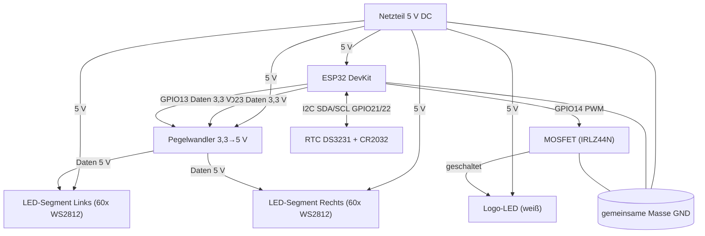

# Schaltung & Stückliste – LED-Fassadenbeleuchtung

Aufbau der Hardware rund um den ESP32: zwei adressierbare LED-Segmente, eine
über PWM/MOSFET gedimmte Logo-LED, eine netzunabhängige Echtzeituhr (DS3231)
und ein 5-V-Netzteil.

> Hinweis: Der endgültige LED-Typ (Pflichtenheft: WS2811, 12 V vs. aktuell
> WS2812, 5 V) und die Netzteil-Dimensionierung sind noch festzulegen
> (siehe Abschnitt 5). Die Firmware ist auf WS2812/GRB und 5 V eingestellt.

---

## 1. Blockschaltbild



Wichtig: **Alle Massen (Netzteil, ESP32, LED-Segmente, MOSFET, Pegelwandler)
müssen verbunden sein** – sonst funktioniert die Datenübertragung nicht.

---

## 2. Pinbelegung ESP32

| Signal | GPIO | Beschreibung |
| --- | --- | --- |
| Segment Links (Daten) | 23 | Datenleitung zum linken Streifen, über Pegelwandler 3,3 → 5 V |
| Segment Rechts (Daten) | 13 | Datenleitung zum rechten Streifen, über Pegelwandler |
| Logo (PWM) | 14 | Gate-Ansteuerung des MOSFET (dimmt die Logo-LED) |
| RTC SDA | 21 | I²C-Datenleitung zum DS3231 |
| RTC SCL | 22 | I²C-Taktleitung zum DS3231 |
| 5 V / GND | – | Versorgung ESP32 und gemeinsame Masse |

(Definiert in `include/config.h`: `PIN_LED_LINKS`, `PIN_LED_RECHTS`,
`PIN_LOGO_PWM`, `PIN_I2C_SDA`, `PIN_I2C_SCL`.)

---

## 3. Schaltungsbeschreibung

**Stromversorgung.** Ein 5-V-Netzteil versorgt ESP32, beide LED-Segmente und
die Logo-Stufe. Die Einspeisung erfolgt sternförmig; bei 120 LEDs empfiehlt sich
eine **beidseitige Einspeisung** (Power-Injection) der Segmente, damit die
Spannung am Ende nicht einbricht. Ein **Elko (≥ 1000 µF, 6,3–16 V)** direkt an
der 5-V-Einspeisung puffert Einschaltströme.

**Datenleitungen.** Der ESP32 gibt 3,3-V-Logik aus, WS2812 erwarten ~5-V-Pegel.
Ein **Pegelwandler** (z. B. 74HCT125 / SN74AHCT125) hebt die beiden Datenleitungen
auf 5 V. In jede Datenleitung gehört ein **Serienwiderstand (330–470 Ω)** nahe
am ersten LED-Eingang gegen Reflexionen.

**Logo-Stufe.** Die einfarbige Logo-LED wird nicht adressiert, sondern über einen
**Logik-Level-N-Kanal-MOSFET** (z. B. IRLZ44N) an GPIO14 per PWM gedimmt
(`ledcSetup`/`ledcAttachPin`, Core 2.x). Am Gate ein **Serienwiderstand (~220 Ω)**,
zwischen Gate und Masse ein **Pull-down (10 kΩ)**, damit der Ausgang beim Booten
definiert aus ist.

**Echtzeituhr.** Das DS3231-Modul hängt am I²C (SDA 21 / SCL 22) und hält per
**Knopfzelle (CR2032)** die Zeit auch ohne Netz. Bei Internetzugang gleicht die
Firmware zusätzlich per NTP ab.

**Schutz.** In die 5-V-Zuleitung gehört eine **Sicherung** passend zum Netzteil
(siehe Abschnitt 5). Für den Außeneinsatz ist ein **wetterfestes Gehäuse
(IP-Schutzart)** vorzusehen.

---

## 4. Stückliste (BOM)

Richtpreise sind grobe Orientierung (Stand Hobby-/Kleinmengen) und **vor der
Bestellung zu prüfen**.

| Pos. | Bauteil | Menge | Bemerkung | Richtpreis |
| --- | --- | ---: | --- | ---: |
| 1 | ESP32 DevKit (esp32dev) | 1 | Steuerung, WLAN | ~ 8 € |
| 2 | LED-Segment WS2812, 60 LEDs | 2 | Links + Rechts (Typ final klären) | ~ 2× 12 € |
| 3 | Logo-LED (weiß, Hochleistung) | 1 | einfarbig, über MOSFET gedimmt | ~ 2 € |
| 4 | RTC-Modul DS3231 | 1 | inkl. Sockel für Knopfzelle | ~ 4 € |
| 5 | Knopfzelle CR2032 | 1 | Pufferung der Uhr | ~ 1 € |
| 6 | Pegelwandler 74HCT125 (o. ä.) | 1 | 3,3 → 5 V für 2 Datenleitungen | ~ 1 € |
| 7 | N-Kanal-Logik-MOSFET IRLZ44N | 1 | Logo-Dimmung | ~ 1 € |
| 8 | Widerstand 330–470 Ω | 2 | Serienwiderstand Datenleitungen | < 1 € |
| 9 | Widerstand 220 Ω | 1 | Gate-Vorwiderstand MOSFET | < 1 € |
| 10 | Widerstand 10 kΩ | 1 | Gate-Pull-down MOSFET | < 1 € |
| 11 | Elko 1000 µF / 16 V | 1 | Puffer an 5-V-Einspeisung | ~ 1 € |
| 12 | Netzteil 5 V DC | 1 | Leistung nach Abschnitt 5 | ~ 20–35 € |
| 13 | Feinsicherung + Halter | 1 | Absicherung 5-V-Zuleitung | ~ 2 € |
| 14 | Gehäuse (IP-geschützt) | 1 | Außeneinsatz | ~ 15–30 € |
| 15 | Verkabelung, Klemmen, Kleinteile | – | Litzen ausreichend Querschnitt | ~ 10 € |

**Grobe Summe (ohne Gehäuse/Netzteil-Aufpreise): ~ 70–90 €.**

---

## 5. Offene Dimensionierung (vor dem Aufbau festlegen)

**Strombedarf der Segmente.** WS2812 ziehen bei Vollweiß ~60 mA pro LED:

```text
120 LEDs × 60 mA ≈ 7,2 A  (nur die Segmente, bei Vollweiß)
+ ESP32 (~0,25 A) + Logo-Stufe
```

Daraus folgt:

- **Netzteil:** 5 V mit Reserve, Richtwert **≥ 8–10 A** (40–50 W). Wird die
  Software-Helligkeit gedeckelt betrieben (`GLOBAL_MAX_BRIGHTNESS`,
  `LED_MAX_MILLIAMPS`), sinkt der reale Bedarf entsprechend.
- **`LED_MAX_MILLIAMPS` in `config.h`** aktuell auf 2000 mA – das ist ein
  Sicherheitswert für den Testaufbau und **auf das reale Netzteil anzupassen**,
  sonst dimmt FastLED die Segmente dauerhaft herunter.
- **Sicherung:** knapp über dem maximalen Dauerstrom des gewählten Netzteils.
- **Leitungsquerschnitt** der 5-V-Versorgung passend zu 7–10 A wählen.

Wird stattdessen der im Pflichtenheft genannte **WS2811 mit 12 V** verwendet,
ändern sich Netzteilspannung, Strombedarf und die FastLED-Konfiguration
(`LED_TYPE`, `LED_VOLTS`) entsprechend.
